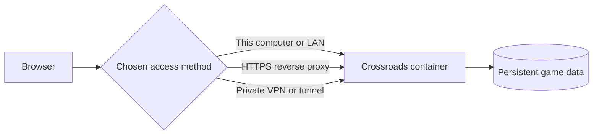

# Self-hosting Crossroads

Crossroads is designed to run as one application container with one persistent data
volume. Docker Engine and Docker Compose v2 are the only requirements for a
basic installation. A domain, Cloudflare account, reverse proxy and public IP
are optional.

## Architecture



Use a single running Crossroads container for each data volume. The saved state is a
local JSON snapshot and is not intended to be shared by multiple replicas.

## Choose an access method

| Use case | Recommended setup |
| --- | --- |
| Play on the Docker host | Keep the default `127.0.0.1:8080` binding |
| Play on a trusted home or office LAN | Bind to the host's private LAN address |
| Private remote access | Put the default service behind a VPN such as Tailscale or WireGuard |
| Public hostname | Put the service behind an HTTPS reverse proxy or outbound tunnel |

Do not expose the application directly to the public internet over plain HTTP.
The room-creation password controls room creation; it is not a substitute for a
firewall, VPN or HTTPS access policy.

## Install from source

Clone the repository or unpack a release source archive, then enter its
directory. No Git credential is needed for a public repository or downloaded
archive.

Create an optional local configuration file:

```sh
cp .env.example .env
chmod 600 .env
```

For the default local-only installation, no values have to be changed. Start
the application:

```sh
docker compose up -d --build
docker compose ps
```

Open `http://localhost:8080`. If `ROOM_CREATE_PASSWORD` is empty, retrieve the
generated room-creation password:

```sh
docker compose exec -T game cat /app/data/access-key
```

The first build downloads the Node base image and application dependencies.
Normal starts reuse the built image.

## Install a published container image

Release publishers can provide a prebuilt image through any OCI-compatible
registry. Set `GAME_IMAGE` to the complete image and version supplied with the
release, then use the image Compose file:

```sh
cp .env.example .env
printf '\nGAME_IMAGE=registry.example/self-hosted-crossroads:1.0.0\n' >> .env
docker compose -f compose.image.yaml pull
docker compose -f compose.image.yaml up -d
```

Use a numbered release tag instead of an unversioned moving tag. For the most
reproducible deployment, use the release's digest form, such as
`registry.example/self-hosted-crossroads:1.0.0@sha256:...`. A private registry may
require `docker login`; a public image does not.

## LAN access

Set `BIND_ADDRESS` in `.env` to the Docker host's actual private network
address, not `0.0.0.0` and not the example below:

```dotenv
BIND_ADDRESS=192.168.1.50
PORT=8080
```

Recreate the container and open `http://192.168.1.50:8080` from another device
on the same trusted network:

```sh
docker compose up -d
```

Restrict the port to the trusted subnet with the host firewall. Plain LAN HTTP
is not encrypted, so do not use this arrangement on an untrusted network.

## HTTPS reverse proxy

You may use an existing Caddy, Traefik, nginx, Nginx Proxy Manager or another
WebSocket-capable proxy. Proxy requests to the bound Crossroads port and set:

```dotenv
SECURE_COOKIE=true
```

Preserve the original `Host` header and forward the original scheme as
`X-Forwarded-Proto`. Same-origin requests then work without an origin list.
`ALLOWED_ORIGINS` is available for unusual arrangements in which the browser
origin differs; it accepts comma-separated exact origins and must not be `*`.
Only enable
`TRUST_PROXY_HEADERS=true` when every request reaches Crossroads through a trusted
proxy, clients cannot connect directly to the application port, and the proxy
overwrites rather than accepts client-supplied forwarding headers.

See [reverse proxy examples](docs/hosting/reverse-proxy.md) for host-installed
Caddy and nginx configurations. For a complete optional outbound setup, see
[Cloudflare Tunnel](docs/hosting/cloudflare-tunnel.md).

## Configuration

| Variable | Default | Purpose |
| --- | --- | --- |
| `APP_NAME` | `Crossroads` | Visible browser name; change it without rebuilding the image |
| `ROOM_CREATE_PASSWORD` | Generated and saved in the data volume | Password required to create rooms; use at least 12 characters when set |
| `BIND_ADDRESS` | `127.0.0.1` | Host address used by the source and image Compose files |
| `PORT` | `8080` | Host port used by the source and image Compose files |
| `SECURE_COOKIE` | `false` | Set to `true` when browsers connect over HTTPS |
| `ALLOWED_ORIGINS` | Same-origin only | Additional exact browser origins, separated by commas |
| `TRUST_PROXY_HEADERS` | `false` | Trust client-address proxy headers; enable only behind a trusted proxy boundary |
| `PLAYER_DISCONNECT_GRACE_MS` | `120000` | Delay before a disconnected seat receives bot assistance |

The Cloudflare recipe has two additional settings documented in its own guide.
Keep `.env` private and do not commit it.

To change the visible product name, set a plain-text value and recreate the
container. This does not rebuild the image or alter saved games:

```dotenv
APP_NAME=My Game Table
```

```sh
docker compose up -d --force-recreate
```

## Updating

Update between games because recreating the container briefly disconnects
players.

For a source installation:

```sh
git pull --ff-only
docker compose up -d --build
docker compose ps
```

For a published image installation, change `GAME_IMAGE` to the desired release
and run:

```sh
docker compose -f compose.image.yaml pull
docker compose -f compose.image.yaml up -d
docker compose -f compose.image.yaml ps
```

To roll back an image installation, restore the previous version in
`GAME_IMAGE` and repeat the same pull and up commands. Saved data remains in
the named volume during ordinary updates and rollbacks.

## Backup and restore

Stop the application so the copied snapshot is consistent:

```sh
mkdir -p backups
docker compose stop game
docker compose cp game:/app/data ./backups/crossroads-data
docker compose start game
```

For an image installation, add `-f compose.image.yaml` to each Compose command.
The backup contains game state, private hands, session identifiers and the
generated room-creation password. Store it privately.

Restore only while the application is stopped. Keep the current volume as a
backup first, then copy `state.json` and `access-key` into `/app/data`. The
files must be writable by UID 1000. Never run `docker compose down -v` unless
you intend to erase all saved data.

## Health and logs

The health endpoint is `/api/health`.

```sh
docker compose ps
docker compose logs --tail=100 game
```

The container has a restart policy, health check and bounded local logs. Docker
itself must be configured to start when the host boots.

## Security boundaries

- Crossroads is intended for a trusted group, not hostile public matchmaking.
- Anyone with a room code can enter its lobby or spectate its game.
- Anonymous player identity is stored in a private browser cookie, not inferred
  from an IP address.
- The server operator can read the persistent game snapshot, including private
  hands, and therefore must be trusted.
- Search-engine directives reduce accidental discovery but do not provide
  access control.
- Back up the data volume and protect `.env` with host filesystem permissions.
- Keep Docker, the host operating system and the deployed Crossroads version current.
- Subscribe to repository security advisories and apply dependency updates.

Report suspected vulnerabilities privately as described in
[`SECURITY.md`](SECURITY.md).

## Troubleshooting

If the container is unhealthy, inspect `docker compose logs game` and verify
that the data volume is writable. If a proxy can load the page but gameplay
does not update, verify WebSocket forwarding, `ALLOWED_ORIGINS` and the original
HTTPS scheme. If a browser cannot reconnect to its seat, confirm it is using
the same browser profile and hostname as before.
