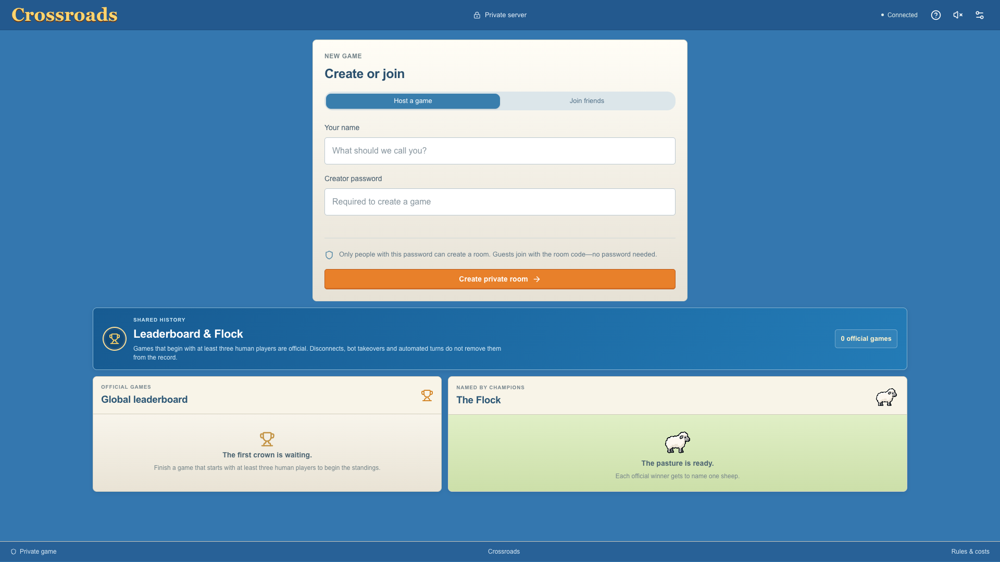
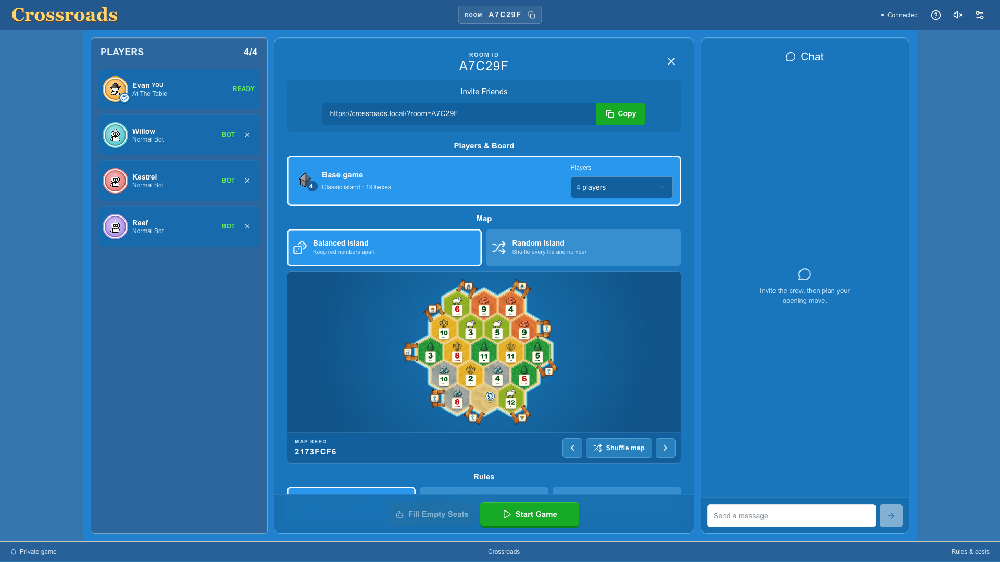
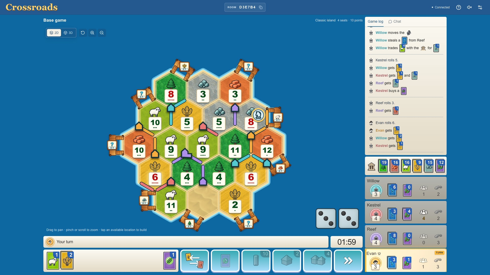
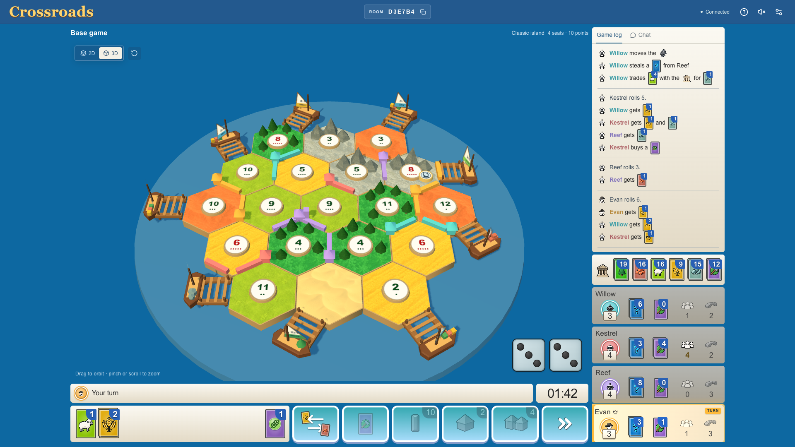
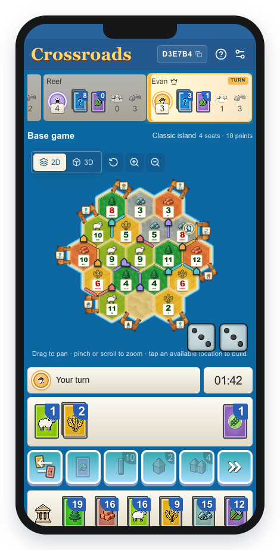

# Self hosted hex based settlement game

A slop-AI-coded, self-hosted way to play a hex-based trading and settlement
game for free with friends and coworkers—without carrying a physical set or
depending on a hosted browser service.

This is an unofficial, self-hosted game inspired by CATAN and online
experiences such as Colonist.io. It is an independent project and is not
affiliated with or endorsed by CATAN, Catan Studio, or Colonist.io.

## Screenshots

### Home screen



### Game lobby



### Game in progress





### Mobile



Refresh every README screenshot from deterministic local game states:

```sh
npm run screenshots
```

The first run may ask you to install the screenshot browser with
`npx playwright install chromium`.

## Commands

Start or rebuild the game:

```sh
docker compose up -d --build
```

Open `http://localhost:8080`.

Show the room-creation password:

```sh
docker compose exec -T game cat /app/data/access-key
```

View logs:

```sh
docker compose logs -f game
```

Stop the game without deleting its data:

```sh
docker compose stop
```

For LAN, remote, HTTPS, update and backup options, see
[`HOSTING.md`](HOSTING.md).
