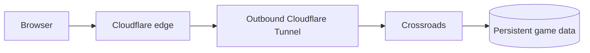

# Cloudflare Tunnel

This is an optional public-HTTPS recipe. The standard installation in
[`HOSTING.md`](../../HOSTING.md) does not require Cloudflare.

## Architecture



Cloudflare terminates public HTTPS. The tunnel reaches Crossroads directly on a
private Docker network. The stack publishes no host ports.

## Requirements

- Docker Engine and Docker Compose v2
- A domain using Cloudflare DNS
- A remotely managed Cloudflare Tunnel
- A source checkout of this project

Repository visibility and the method used to obtain the source are independent
of this deployment. Do not put source-control credentials in `.env` or a clone
URL.

## Create the tunnel

In Cloudflare Zero Trust:

1. Open **Networks -> Tunnels** and create a Cloudflared tunnel.
2. Copy the token shown in the Docker instructions.
3. Add a public hostname for the desired game domain.
4. Set its service type to **HTTP** and its URL to `game:8080`.

The tunnel token authorizes a connector to run the tunnel. Treat it as a
secret and rotate it if it is exposed.

## Configure the stack

Create a private environment file in the project directory:

```sh
cp deploy/cloudflare.env.example .env
chmod 600 .env
```

Set these values:

```dotenv
ROOM_CREATE_PASSWORD=replace-with-a-long-unique-password
PUBLIC_HOSTNAME=game.example.com
CF_TUNNEL_TOKEN=replace-with-the-cloudflare-tunnel-token
```

`PUBLIC_HOSTNAME` contains only the hostname, without a scheme, port or path.
Guests do not need `ROOM_CREATE_PASSWORD`; it only authorizes room creation.

## Start and verify

```sh
docker compose -f compose.hosted.yaml config
docker compose -f compose.hosted.yaml up -d --build
docker compose -f compose.hosted.yaml ps
docker compose -f compose.hosted.yaml logs --tail=50 game cloudflared
```

Open `https://game.example.com/api/health`, replacing the example hostname. It
should return an `ok` response naming Crossroads.

## Update

Update between games:

```sh
git pull --ff-only
docker compose -f compose.hosted.yaml pull cloudflared
docker compose -f compose.hosted.yaml up -d --build
docker compose -f compose.hosted.yaml ps
```

Saved game data remains in the `game-data` volume. Follow the generic backup
and restore instructions in [`HOSTING.md`](../../HOSTING.md), adding
`-f compose.hosted.yaml` to the Compose commands.
