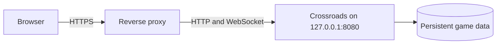

# HTTPS reverse proxy examples

Use these examples when Crossroads runs on the same host as an existing reverse
proxy. Keep Crossroads bound to `127.0.0.1` so clients cannot bypass the proxy.

## Architecture



Set the application for HTTPS before recreating it:

```dotenv
BIND_ADDRESS=127.0.0.1
PORT=8080
SECURE_COOKIE=true
TRUST_PROXY_HEADERS=true
```

The examples preserve the browser's `Host` header, so no `ALLOWED_ORIGINS`
entry is needed. Only add exact origins there if the browser intentionally uses
a different origin. They also overwrite the forwarded client address before
Crossroads uses it for rate limiting.

## Caddy

Replace the hostname and add this site to the host's Caddyfile:

```caddyfile
game.example.com {
    reverse_proxy 127.0.0.1:8080
}
```

Caddy obtains and renews HTTPS certificates when public DNS points to the host
and ports 80 and 443 can reach Caddy.

## nginx

Define the WebSocket connection mapping once in nginx's `http` context:

```nginx
map $http_upgrade $connection_upgrade {
    default upgrade;
    '' close;
}
```

Use this location in the HTTPS server for the game hostname:

```nginx
location / {
    proxy_pass http://127.0.0.1:8080;
    proxy_http_version 1.1;
    proxy_set_header Host $host;
    proxy_set_header X-Forwarded-Proto $scheme;
    proxy_set_header X-Forwarded-For $remote_addr;
    proxy_set_header Upgrade $http_upgrade;
    proxy_set_header Connection $connection_upgrade;
    proxy_read_timeout 3600;
}
```

Configure the nginx certificate separately with the certificate provider used
by the host.

## Containerized proxies

Inside a proxy container, `127.0.0.1` refers to that proxy rather than Crossroads.
Attach the proxy and Crossroads to one private Docker network and route to the Crossroads
service name on port 8080. Do not publish the application port when the shared
network is the only intended path.

## Verification

After reloading the proxy, open:

```text
https://game.example.com/api/health
```

The response should report `ok`. If the page loads but live game updates fail,
check WebSocket forwarding and inspect `docker compose logs game`.
